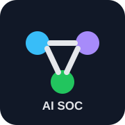
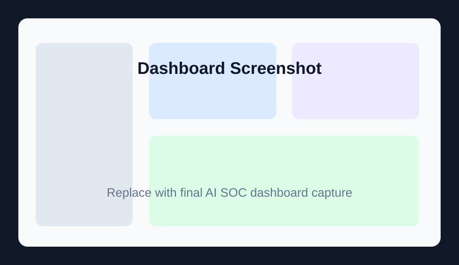
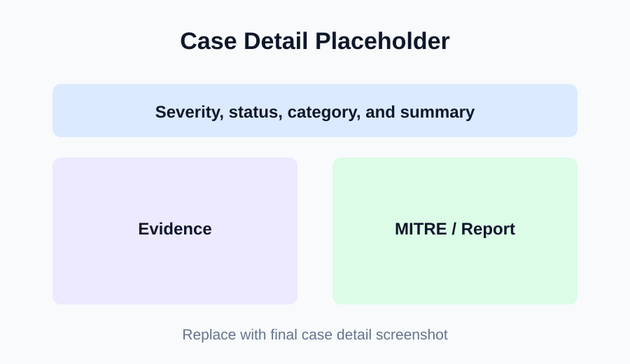
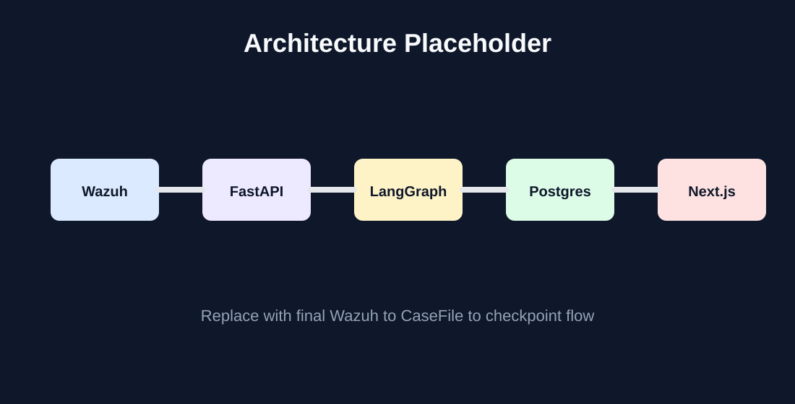

<a id="readme-top"></a>

[![Contributors][contributors-shield]][contributors-url]
[![Forks][forks-shield]][forks-url]
[![Stargazers][stars-shield]][stars-url]
[![Issues][issues-shield]][issues-url]

<br />
<div align="center">
  <a href="https://github.com/mahmoudaher/ai-soc-investigator">
    
  </a>

  <h3 align="center">AI SOC Investigator</h3>

  <p align="center">
    A multi-agent SOC investigation platform that ingests Wazuh alerts, normalizes them into structured case files, orchestrates LangGraph agents, stores checkpoints in PostgreSQL, and exposes a Next.js analyst dashboard.
    <br />
    <a href="docs/architecture.md"><strong>Explore the docs »</strong></a>
    <br />
    <br />
    <a href="#usage">View Usage</a>
    &middot;
    <a href="https://github.com/mahmoudaher/ai-soc-investigator/issues/new">Report Bug</a>
    &middot;
    <a href="https://github.com/mahmoudaher/ai-soc-investigator/issues/new">Request Feature</a>
  </p>
</div>

<details>
  <summary>Table of Contents</summary>
  <ol>
    <li>
      <a href="#about-the-project">About The Project</a>
      <ul>
        <li><a href="#built-with">Built With</a></li>
      </ul>
    </li>
    <li>
      <a href="#getting-started">Getting Started</a>
      <ul>
        <li><a href="#prerequisites">Prerequisites</a></li>
        <li><a href="#installation">Installation</a></li>
      </ul>
    </li>
    <li><a href="#usage">Usage</a></li>
    <li><a href="#architecture">Architecture</a></li>
    <li><a href="#agent-workflow">Agent Workflow</a></li>
    <li><a href="#project-structure">Project Structure</a></li>
    <li><a href="#validation">Validation</a></li>
    <li><a href="#security-notes">Security Notes</a></li>
    <li><a href="#roadmap">Roadmap</a></li>
    <li><a href="#contributing">Contributing</a></li>
    <li><a href="#license">License</a></li>
    <li><a href="#contact">Contact</a></li>
    <li><a href="#acknowledgments">Acknowledgments</a></li>
  </ol>
</details>

## About The Project

[![AI SOC Investigator overview placeholder][project-screenshot]](#architecture)

AI SOC Investigator is a multi-agent incident analysis platform for security operations workflows. It is designed around one core idea: a SOC alert should not be handled by one large, unstructured model call. Instead, specialized agents collaborate on the same structured `CaseFile`, making every investigation step traceable, reviewable, and ready for analyst handoff.

When a Wazuh alert arrives, the FastAPI backend normalizes it into a consistent schema, creates a case, stores the initial checkpoint, and can run the full AI investigation workflow in the background. The workflow uses dedicated agents for triage, evidence extraction, enrichment, MITRE ATT&CK mapping, reporting, and final status handling.

Current capabilities verified from this repository include:

- Wazuh alert ingestion through `POST /alerts/wazuh`.
- Normalized alert model for consistent downstream processing.
- Shared Pydantic `CaseFile` state passed between agents.
- LangGraph workflow orchestration.
- LLM-backed triage, evidence extraction, MITRE mapping, and reporting with Gemini configuration.
- Optional VirusTotal enrichment support in the recon agent.
- PostgreSQL persistence for cases and workflow checkpoints.
- FastAPI endpoints for case listing, case details, and checkpoint history.
- Next.js dashboard for reviewing cases and creating new investigations.
- Docker Compose deployment for PostgreSQL, API, and optional dashboard profile.
- Test fixtures for Wazuh alert normalization and case serialization contracts.

<p align="right">(<a href="#readme-top">back to top</a>)</p>

### Built With

- [![Python][python-shield]][python-url]
- [![FastAPI][fastapi-shield]][fastapi-url]
- [![LangGraph][langgraph-shield]][langgraph-url]
- [![Pydantic][pydantic-shield]][pydantic-url]
- [![PostgreSQL][postgresql-shield]][postgresql-url]
- [![SQLAlchemy][sqlalchemy-shield]][sqlalchemy-url]
- [![Next.js][next-shield]][next-url]
- [![React][react-shield]][react-url]
- [![TypeScript][typescript-shield]][typescript-url]
- [![Tailwind CSS][tailwind-shield]][tailwind-url]
- [![Docker][docker-shield]][docker-url]

<p align="right">(<a href="#readme-top">back to top</a>)</p>

## Getting Started

The fastest path is Docker Compose, which runs PostgreSQL and the FastAPI API. The dashboard is available through an optional Compose profile.

### Prerequisites

For Docker deployment:

- Git.
- Docker and Docker Compose.

For local development:

- Python 3.11 or 3.12, as documented in `docs/DEPLOYMENT.md`.
- Node.js 22+ for frontend development.
- PostgreSQL if running without Docker.

Optional external API keys:

- `GEMINI_API_KEY` for full LLM-backed agent workflow execution.
- `VIRUSTOTAL_API_KEY` for recon enrichment.

### Installation

1. Clone the repository:

   ```bash
   git clone https://github.com/mahmoudaher/ai-soc-investigator.git
   ```

2. Open the project folder:

   ```bash
   cd ai-soc-investigator
   ```

3. Create an environment file:

   ```bash
   cp .env.example .env
   ```

   On Windows PowerShell:

   ```powershell
   Copy-Item .env.example .env
   ```

4. Edit `.env` and add keys when needed:

   ```text
   GEMINI_API_KEY=<your Gemini key>
   VIRUSTOTAL_API_KEY=<optional VirusTotal key>
   ```

5. Start PostgreSQL and the API:

   ```bash
   docker compose --env-file .env up --build postgres api
   ```

6. Open the API docs:

   ```text
   http://localhost:8000/docs
   ```

7. Start the dashboard profile:

   ```bash
   docker compose --env-file .env --profile dashboard up --build
   ```

8. Open the dashboard:

   ```text
   http://localhost:3000
   ```

<p align="right">(<a href="#readme-top">back to top</a>)</p>

## Usage

### API Endpoints

| Method | Endpoint | Purpose |
| --- | --- | --- |
| `GET` | `/health` | Health check |
| `POST` | `/alerts/wazuh` | Ingest a Wazuh alert and optionally run the workflow |
| `GET` | `/cases` | List recent cases |
| `GET` | `/cases/{case_id}` | Read one case file |
| `GET` | `/cases/{case_id}/checkpoints` | Read workflow checkpoint history |

Use `run_workflow=false` on `/alerts/wazuh` for an ingestion-only smoke test that does not call LLM or enrichment services.

### Ingestion-Only Smoke Test

```bash
curl -X POST "http://localhost:8000/alerts/wazuh?run_workflow=false" \
  -H "Content-Type: application/json" \
  -d '{"rule":{"level":7,"description":"sshd authentication failed","groups":["sshd","authentication_failed"]},"agent":{"name":"ubuntu-victim"},"data":{"srcip":"10.0.2.15","srcuser":"admin"}}'
```

### Full Workflow Smoke Test

The full workflow requires `GEMINI_API_KEY`.

```bash
curl -X POST "http://localhost:8000/alerts/wazuh?run_workflow=true" \
  -H "Content-Type: application/json" \
  -d '{"rule":{"level":10,"description":"SQL Injection attempt detected","groups":["web","attack"]},"agent":{"name":"web-server"},"data":{"srcip":"8.8.8.8","srcuser":"root"}}'
```

### Local Backend Development

```bash
python -m venv .venv
.venv\Scripts\activate
pip install -r requirements.txt
copy .env.example .env
docker compose up -d postgres
python scripts\init_db.py
uvicorn backend.app.main:app --reload --port 8000
```

### Local Frontend Development

```bash
cd frontend/ai-soc-dashboard
copy env.example.txt .env.local
npm install
npm run dev
```

### Visual Placeholders

Placeholder images are included under `docs/images/` so you can replace them manually later without changing the README layout.

<p align="center">
  
  
</p>

Suggested final visuals:

- Dashboard overview.
- Case list.
- Case detail page.
- New case ingestion form.
- Workflow graph from `docs/workflow.md`.
- Database/checkpoint diagram.

See [docs/VISUALS.md](docs/VISUALS.md) for the project’s visual checklist.

<p align="right">(<a href="#readme-top">back to top</a>)</p>

## Architecture

```text
Wazuh alert or simulated alert
        |
FastAPI POST /alerts/wazuh
        |
Wazuh normalization
        |
CaseFile creation
        |
PostgreSQL case + ingest checkpoint
        |
LangGraph workflow
        |
triage -> evidence -> recon -> mapper -> reporter -> finalizer
        |
PostgreSQL case updates + per-node checkpoints
        |
Next.js SOC dashboard
```

<p align="center">
  
</p>

More detail is available in [docs/architecture.md](docs/architecture.md).

<p align="right">(<a href="#readme-top">back to top</a>)</p>

## Agent Workflow

The active LangGraph pipeline is:

1. `triage`: classifies the alert and records initial analysis.
2. `evidence`: extracts technical artifacts from the raw alert.
3. `recon`: enriches observables with VirusTotal when configured.
4. `mapper`: maps investigation context to MITRE ATT&CK techniques.
5. `reporter`: generates the final investigation summary and recommendations.
6. `finalizer`: marks the case as completed or failed.

The generated Mermaid workflow is available in [docs/workflow.md](docs/workflow.md). Regenerate it with:

```bash
python scripts/export_workflow_graph.py
```

<p align="right">(<a href="#readme-top">back to top</a>)</p>

## Project Structure

```text
.
├── backend/                    # FastAPI app, agents, models, database layer, tests
├── docs/                       # Architecture, workflow, deployment, GitHub, visual docs
├── frontend/ai-soc-dashboard/  # Next.js analyst dashboard
├── infrastructure/             # Infrastructure notes
├── scripts/                    # Database and workflow utility scripts
├── tool-runner/                # Placeholder for future isolated tool execution
├── workers/                    # Placeholder for future async workers
├── docker-compose.yml          # Local Compose stack
├── requirements.txt            # Python backend dependencies
├── simulate_wazuh.py           # Sends a sample Wazuh alert to the API
└── test_workflow.py            # Local workflow/database demo script
```

<p align="right">(<a href="#readme-top">back to top</a>)</p>

## Validation

Compile Python files:

```bash
python -m compileall backend scripts simulate_wazuh.py test_workflow.py
```

Run stable non-LLM tests:

```bash
python -m pytest backend/tests/unit/test_wazuh_normalization.py backend/tests/contracts/test_casefile_schema.py -q
```

Full workflow tests currently require the LLM/enrichment-era tests to be aligned with the active Gemini-based agents and external-service configuration.

<p align="right">(<a href="#readme-top">back to top</a>)</p>

## Security Notes

This is a research/prototype project. Do not commit:

- Real `.env` files.
- Gemini API keys.
- VirusTotal API keys.
- Wazuh exports containing sensitive alert data.
- Production alerts or analyst case data.
- Any credentials from live SOC infrastructure.

Use synthetic or sanitized alerts for demos.

<p align="right">(<a href="#readme-top">back to top</a>)</p>

## Roadmap

- [ ] Replace placeholder images with final screenshots and architecture diagrams.
- [ ] Add dashboard overview and case-detail visuals.
- [ ] Add database/checkpoint diagram for `cases` and `case_checkpoints`.
- [ ] Align full workflow tests with the active Gemini-backed agents and external-service configuration.
- [ ] Expand isolated tool execution in `tool-runner/`.
- [ ] Add production deployment hardening and secrets-management guidance.

See the [open issues](https://github.com/mahmoudaher/ai-soc-investigator/issues) for proposed features and known issues.

<p align="right">(<a href="#readme-top">back to top</a>)</p>

## Contributing

Contributions are welcome for agent logic, Wazuh normalization, dashboard workflows, tests, documentation, and deployment hardening.

1. Fork the project.
2. Create your feature branch:

   ```bash
   git checkout -b feature/AmazingFeature
   ```

3. Commit your changes:

   ```bash
   git commit -m "Add some AmazingFeature"
   ```

4. Push to the branch:

   ```bash
   git push origin feature/AmazingFeature
   ```

5. Open a pull request.

<p align="right">(<a href="#readme-top">back to top</a>)</p>

### Top Contributors

<a href="https://github.com/mahmoudaher/ai-soc-investigator/graphs/contributors">
  
</a>

## License

No root license file has been added to this repository yet. Add a repository-level license before reuse or distribution outside the intended prototype context.

The nested dashboard template includes `frontend/ai-soc-dashboard/LICENSE`; review that file separately for frontend template licensing details.

<p align="right">(<a href="#readme-top">back to top</a>)</p>

## Contact

Mahmoud Aher - [@mahmoudaher](https://github.com/mahmoudaher)

Project Link: [https://github.com/mahmoudaher/ai-soc-investigator](https://github.com/mahmoudaher/ai-soc-investigator)

<p align="right">(<a href="#readme-top">back to top</a>)</p>

## Acknowledgments

- README structure adapted from [ahmed3bahaa/readme-template](https://github.com/ahmed3bahaa/readme-template).
- LangGraph, FastAPI, PostgreSQL, Next.js, Wazuh, and MITRE ATT&CK ecosystems.
- Dashboard template code credited in the nested frontend package metadata and license.

<p align="right">(<a href="#readme-top">back to top</a>)</p>

[contributors-shield]: https://img.shields.io/github/contributors/mahmoudaher/ai-soc-investigator.svg?style=for-the-badge
[contributors-url]: https://github.com/mahmoudaher/ai-soc-investigator/graphs/contributors
[forks-shield]: https://img.shields.io/github/forks/mahmoudaher/ai-soc-investigator.svg?style=for-the-badge
[forks-url]: https://github.com/mahmoudaher/ai-soc-investigator/network/members
[stars-shield]: https://img.shields.io/github/stars/mahmoudaher/ai-soc-investigator.svg?style=for-the-badge
[stars-url]: https://github.com/mahmoudaher/ai-soc-investigator/stargazers
[issues-shield]: https://img.shields.io/github/issues/mahmoudaher/ai-soc-investigator.svg?style=for-the-badge
[issues-url]: https://github.com/mahmoudaher/ai-soc-investigator/issues
[project-screenshot]: docs/images/project-overview-placeholder.svg
[python-shield]: https://img.shields.io/badge/Python-3776AB?style=for-the-badge&logo=python&logoColor=white
[python-url]: https://www.python.org/
[fastapi-shield]: https://img.shields.io/badge/FastAPI-009688?style=for-the-badge&logo=fastapi&logoColor=white
[fastapi-url]: https://fastapi.tiangolo.com/
[langgraph-shield]: https://img.shields.io/badge/LangGraph-1C3C3C?style=for-the-badge
[langgraph-url]: https://www.langchain.com/langgraph
[pydantic-shield]: https://img.shields.io/badge/Pydantic-E92063?style=for-the-badge&logo=pydantic&logoColor=white
[pydantic-url]: https://docs.pydantic.dev/
[postgresql-shield]: https://img.shields.io/badge/PostgreSQL-4169E1?style=for-the-badge&logo=postgresql&logoColor=white
[postgresql-url]: https://www.postgresql.org/
[sqlalchemy-shield]: https://img.shields.io/badge/SQLAlchemy-D71F00?style=for-the-badge
[sqlalchemy-url]: https://www.sqlalchemy.org/
[next-shield]: https://img.shields.io/badge/Next.js-000000?style=for-the-badge&logo=nextdotjs&logoColor=white
[next-url]: https://nextjs.org/
[react-shield]: https://img.shields.io/badge/React-20232A?style=for-the-badge&logo=react&logoColor=61DAFB
[react-url]: https://react.dev/
[typescript-shield]: https://img.shields.io/badge/TypeScript-3178C6?style=for-the-badge&logo=typescript&logoColor=white
[typescript-url]: https://www.typescriptlang.org/
[tailwind-shield]: https://img.shields.io/badge/Tailwind_CSS-38B2AC?style=for-the-badge&logo=tailwindcss&logoColor=white
[tailwind-url]: https://tailwindcss.com/
[docker-shield]: https://img.shields.io/badge/Docker-2496ED?style=for-the-badge&logo=docker&logoColor=white
[docker-url]: https://www.docker.com/
