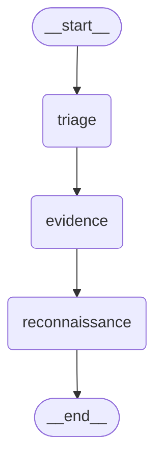

# AI SOC Investigator Architecture

## 1. Project Purpose

`ai-soc-investigator` is an agent-based SOC investigation prototype built around a shared `CaseFile` state model and a LangGraph workflow.

The current goal of the project is not full production integration yet. The current codebase is focused on proving that:

- agents can communicate through one shared state object
- each agent updates only the fields it owns
- the workflow can be tested end to end
- the state can be serialized safely for future transport layers such as Kafka

At the moment, the project uses mocked logic and hard-coded enrichment to validate architecture and state flow. These parts are expected to be replaced later with:

- Wazuh as the alert source
- LLM-backed reasoning in selected agents
- Kafka as the event backbone between services

## 2. Current Backend Flow

The active workflow is defined in [backend/app/orchestration/graph.py](/c:/Graduation/ai-soc-investigator/backend/app/orchestration/graph.py).

Current agent order:

1. `triage`
2. `evidence`
3. `reconnaissance`
4. `END`

The current LangGraph Mermaid output is:



You can regenerate the live graph text from code with:

```python
from backend.app.orchestration.graph import get_case_workflow_mermaid

print(get_case_workflow_mermaid())
```

There is also a lower-level LangGraph call available:

```python
app = build_case_workflow()
print(app.get_graph().draw_mermaid())
```

## 3. Core State Model

The shared investigation state is defined in [backend/app/models/casefile.py](/c:/Graduation/ai-soc-investigator/backend/app/models/casefile.py).

### 3.1 Main Model

`CaseFile` is the central object passed through all agents.

Important fields:

- `case_id`: unique case identifier
- `raw_alert`: original incoming alert payload
- `status`: current case status
- `severity`: current severity classification
- `category`: current case category
- `subcategory`: optional later refinement
- `triage`: structured triage result used by downstream agents
- `created_at`: case creation time
- `updated_at`: last mutation time
- `assigned_to`: future analyst ownership
- `tags`: general case tags
- `priority`: case handling priority
- `entities`: extracted observables or subjects
- `evidence`: normalized evidence items
- `timeline`: ordered case history
- `hypotheses`: future analysis hypotheses
- `mitre`: future ATT&CK mappings
- `recommendations`: future recommended actions
- `agent_runs`: execution history for agents
- `summary`: future high-level report summary
- `investigation_notes`: free-form notes collection

### 3.2 Supporting Models

#### `Entity`

Represents extracted observables such as:

- IP address
- host
- user
- domain
- process

Key fields:

- `id`
- `type`
- `value`
- `confidence`
- `first_seen`
- `last_seen`
- `metadata`

#### `EvidenceItem`

Represents normalized evidence produced by agents.

Key fields:

- `id`
- `type`
- `payload`
- `created_at`
- `source`
- `confidence`
- `tags`

#### `TimelineEvent`

Represents major case events.

Key fields:

- `id`
- `timestamp`
- `title`
- `description`
- `evidence_ids`
- `agent`
- `event_type`

#### `TriageAssessment`

Structured output of `triage_agent`.

Key fields:

- `summary`
- `confidence`
- `plan`

#### `TriagePlanStep`

Each plan step tells downstream agents what to validate and why.

Key fields:

- `entity_type`
- `entity_value`
- `goal`
- `rationale`
- `priority`

#### `AgentRun`

Tracks agent execution metadata.

Key fields:

- `agent`
- `status`
- `started_at`
- `finished_at`
- `error`
- `duration_ms`
- `input_tokens`
- `output_tokens`
- `cost`

### 3.3 Time Handling

The codebase currently standardizes timestamps through `utc_now()` in [backend/app/models/casefile.py](/c:/Graduation/ai-soc-investigator/backend/app/models/casefile.py).

This is important because:

- Python 3.14 warns against `datetime.utcnow()`
- timezone-aware UTC is safer for serialization
- Kafka and distributed processing will need stable timestamps

## 4. Agent Responsibilities

The project currently has three working agents.

### 4.1 `triage_agent`

File: [backend/app/agents/triage.py](/c:/Graduation/ai-soc-investigator/backend/app/agents/triage.py)

Purpose:

- classify the alert
- extract initial entities
- produce a structured triage assessment for downstream agents

Reads:

- `raw_alert`
- existing `entities`
- existing `timeline`
- existing `agent_runs`

Writes:

- `severity`
- `category`
- `status`
- `triage.summary`
- `triage.confidence`
- `triage.plan`
- appended `entities`
- one new `timeline` event
- one new `agent_runs` entry
- `updated_at`

Does not own:

- `mitre`
- `recommendations`
- `summary`

### 4.2 `evidence_agent`

File: [backend/app/agents/evidence.py](/c:/Graduation/ai-soc-investigator/backend/app/agents/evidence.py)

Purpose:

- enrich extracted entities using mocked threat-intelligence style lookups
- normalize those results into `EvidenceItem` objects

Reads:

- `entities`
- existing `evidence`
- existing `timeline`
- existing `agent_runs`

Writes:

- appended `evidence`
- one new `timeline` event
- one new `agent_runs` entry
- `updated_at`

Current mock behavior:

- IPs return reputation-style data
- domains return creation and resolved-IP style data
- users return login-related data
- hosts return OS and patch-style data

### 4.3 `recon_agent`

File: [backend/app/agents/recon.py](/c:/Graduation/ai-soc-investigator/backend/app/agents/recon.py)

Purpose:

- validate triage plan items
- add contextual follow-up notes to evidence

Reads:

- `triage.plan`
- existing `evidence`
- existing `timeline`
- existing `agent_runs`

Writes:

- appended `evidence`
- one new `timeline` event
- one new `agent_runs` entry
- `updated_at`

Current mock behavior:

- classify an IP as `private_ip` or `public_ip`
- classify a host as `lab_host` or `host_observed`
- mark domain, user, or process observations

## 5. Ownership Boundaries

The current architecture works best if each agent owns a narrow slice of the `CaseFile`.

Current ownership model:

- `triage_agent` owns classification and triage planning
- `evidence_agent` owns threat-intel enrichment evidence
- `recon_agent` owns validation/confirmation evidence
- future `ttp_mapper_agent` should own `mitre`
- future `reporter_agent` should own reporting fields such as `summary`

This boundary is important because it prevents uncontrolled field mutation as the workflow grows.

## 6. Current Tests

The main tests live in [backend/tests](/c:/Graduation/ai-soc-investigator/backend/tests).

### `test_triage_agent.py`

Covers:

- schema compatibility
- field ownership
- entity extraction
- triage structure generation

### `test_evidence_agent.py`

Covers:

- schema compatibility
- correct use of `evidence`
- enum/status checks
- ownership preservation
- repeat-run behavior

### `test_recon_agent.py`

Covers:

- schema compatibility
- triage-plan-driven recon evidence
- ownership preservation
- repeat-run behavior

### `test_casefile_serialization_agent.py`

Covers:

- JSON round-trip of a populated `CaseFile`
- preservation of nested required fields after serialization

### `test_graph_workflow.py`

Covers:

- end-to-end graph execution
- triage/evidence/recon ordering
- timeline and evidence growth
- recon validation outcomes for lab/private-IP style alerts

## 7. Current Weak Points

The project is moving in a good direction, but these are the main areas that can become hard to manage if not documented clearly:

- `CaseFile` is growing quickly and needs strong ownership discipline
- future branching workflows may make graph behavior harder to trace
- agent outputs will become more variable once LLM calls are introduced
- future Kafka integration will require stable event/message contracts
- placeholder services such as workers and tool-runner are not implemented yet

## 8. Recommended Documentation Discipline

To keep the project manageable as more agents arrive:

1. Keep this document updated whenever a new agent is added.
2. For each new agent, document:
   - what it reads
   - what it writes
   - what it must not modify
3. Keep the graph definition in one place only.
4. Add a test whenever a new field is introduced into `CaseFile`.
5. Add a serialization test whenever a new nested model is added.

## 9. Near-Term Roadmap

Expected next additions based on the current design:

- `ttp_mapper_agent`
  - consumes case context and evidence
  - writes `mitre`
  - appends timeline and agent run records

- `reporter_agent`
  - consumes the final case context
  - writes case summary/report output
  - appends timeline and agent run records

- Wazuh ingestion
  - replaces the current mock alert input

- Kafka transport
  - moves case updates between services while preserving serialized `CaseFile` compatibility

## 10. Useful Commands

Run all tests:

```powershell
python -m unittest discover -s backend\tests -v
```

Print the current graph as Mermaid:

```powershell
@'
from backend.app.orchestration.graph import get_case_workflow_mermaid
print(get_case_workflow_mermaid())
'@ | python -
```

Export the current graph into docs files:

```powershell
python scripts\export_workflow_graph.py
```

Run the current workflow demo:

```powershell
python test_workflow.py
```
