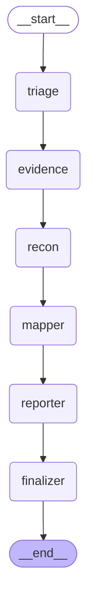

# Workflow Diagram

This file is generated from `backend/app/orchestration/graph.py`.

```mermaid
---
config:
  flowchart:
    curve: linear
---
graph TD;
	__start__([<p>__start__</p>]):::first
	triage(triage)
	evidence(evidence)
	recon(recon)
	mapper(mapper)
	reporter(reporter)
	finalizer(finalizer)
	__end__([<p>__end__</p>]):::last
	__start__ --> triage;
	evidence --> recon;
	mapper --> reporter;
	recon --> mapper;
	reporter --> finalizer;
	triage --> evidence;
	finalizer --> __end__;
	classDef default fill:#f2f0ff,line-height:1.2
	classDef first fill-opacity:0
	classDef last fill:#bfb6fc

```
